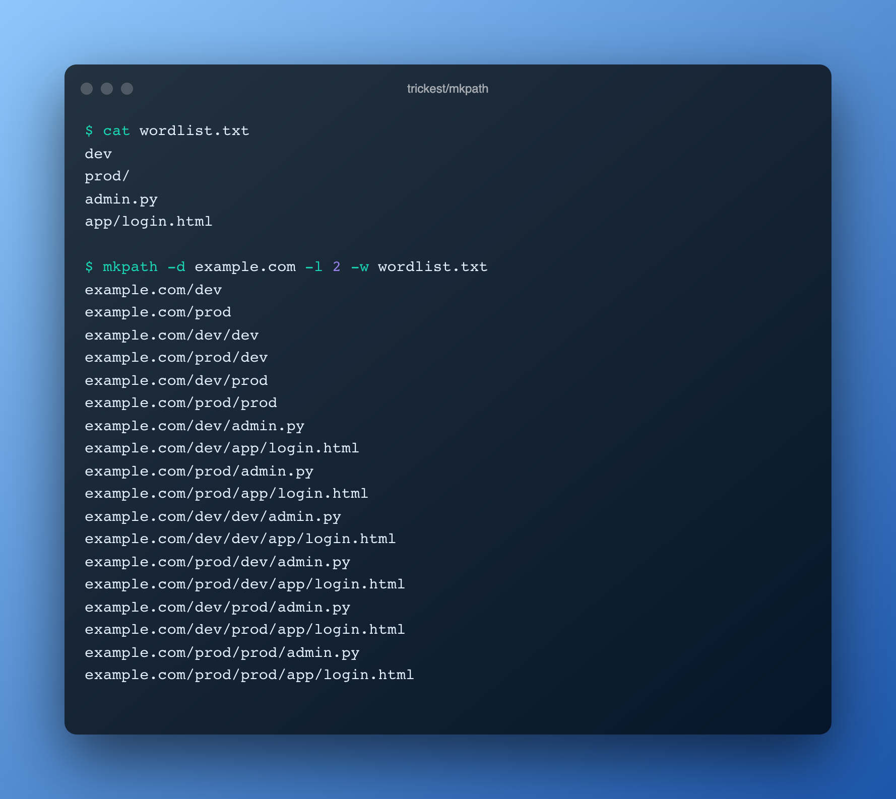

<h1 align="center">mkpath <a href="https://twitter.com/intent/tweet?text=mkpath%20-%20Make%20URL%20path%20combinations%20using%20a%20wordlist%20https%3A%2F%2Fgithub.com%2Ftrickest%2Fmkpath&hashtags=bugbounty,bugbountytips,infosec"></a></h1>
<h3 align="center">Make URL path combinations using a wordlist</h3>



Read a wordlist file and generate path combinations for given domain or list of domains. Input from wordlist file is lowercased and unique words are processed. Additionally, wordlist can be filtered using regex. 

When you use mkpath's `-l` parameter, it will generate all path combinations up to the specified level, including all lower levels, using words from the wordlist. For instance, with `-l 2`, it will generate `len(permutation_list)^2 + len(permutation_list)` results, which is:
- 30 combinations for a 5-word wordlist.
- 10100 combinations for a 100-word wordlist. 
- 250500 combinations for a 500-word wordlist.


# Installation
## Binary
Binaries are available in the [latest release](https://github.com/trickest/mkpath/releases/latest).

## Docker
```
docker run quay.io/trickest/mkpath
```

## From source
```
go install github.com/trickest/mkpath@latest
```

# Usage
```
  -d string
    	Input domain
  -df string
    	Input domain file, one domain per line
  -l int
    	URL path depth to generate (default 1) (default 1)
  -lower
    	Convert wordlist file content to lowercase (default false)
  -o string
    	Output file (optional)
  -only-dirs
    	Generate directories only, files are filtered out (default false)
  -only-files
    	Generate files only, file names are appended to given domains (default false)
  -r string
    	Regex to filter words from wordlist file
  -w string
    	Wordlist file
```

### Example
##### wordlist.txt
```
dev
prod/
admin.py
app/login.html
```

```shell script
$ mkpath -d example.com -l 2 -w wordlist.txt
example.com/dev
example.com/prod
example.com/dev/dev
example.com/prod/dev
example.com/dev/prod
example.com/prod/prod
example.com/dev/admin.py
example.com/dev/app/login.html
example.com/prod/admin.py
example.com/prod/app/login.html
example.com/dev/dev/admin.py
example.com/dev/dev/app/login.html
example.com/prod/dev/admin.py
example.com/prod/dev/app/login.html
example.com/dev/prod/admin.py
example.com/dev/prod/app/login.html
example.com/prod/prod/admin.py
example.com/prod/prod/app/login.html

```

# Report Bugs / Feedback
We look forward to any feedback you want to share with us or if you're stuck with a problem you can contact us at [support@trickest.com](mailto:support@trickest.com). You can also create an [Issue](https://github.com/trickest/mkpath/issues/new) or pull request on the Github repository.

# Where does this fit in your methodology?
Mkpath is an integral part of many workflows in the Trickest store. Sign up on [trickest.com](https://trickest.com) to get access to these workflows or build your own from scratch!

[](https://trickest-access.paperform.co/)
